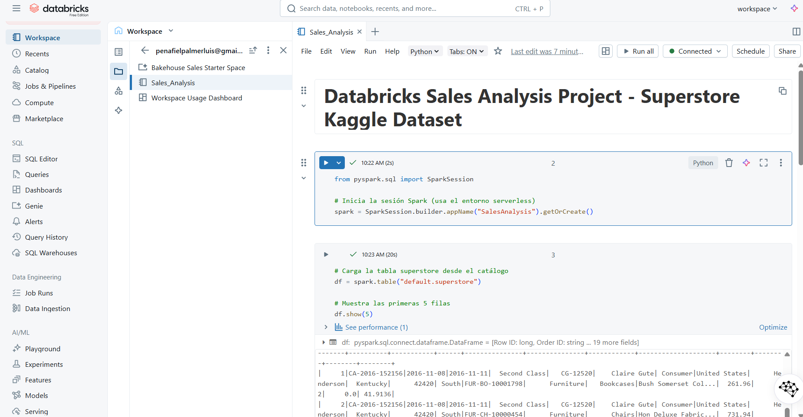
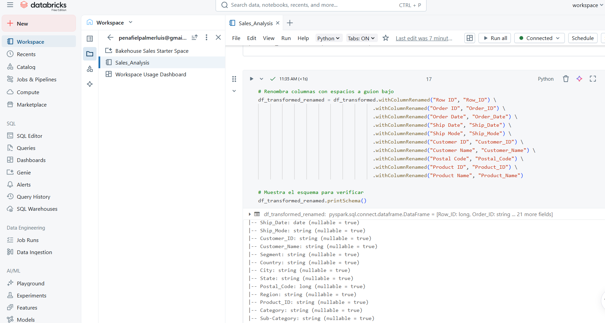
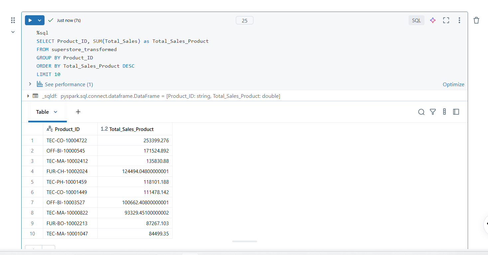
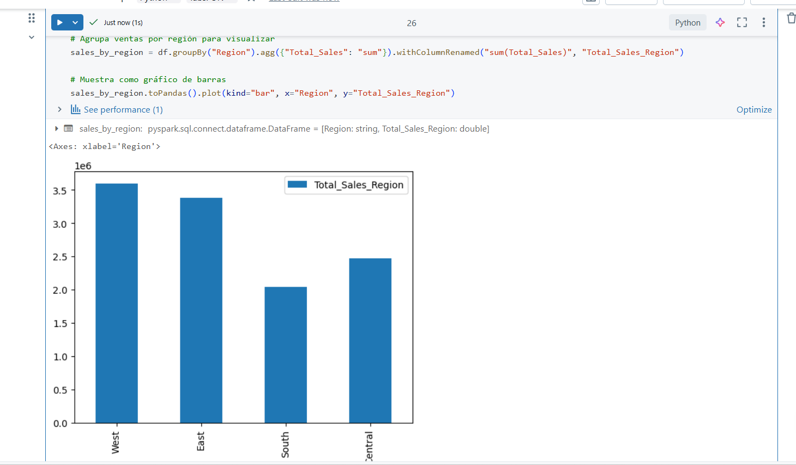
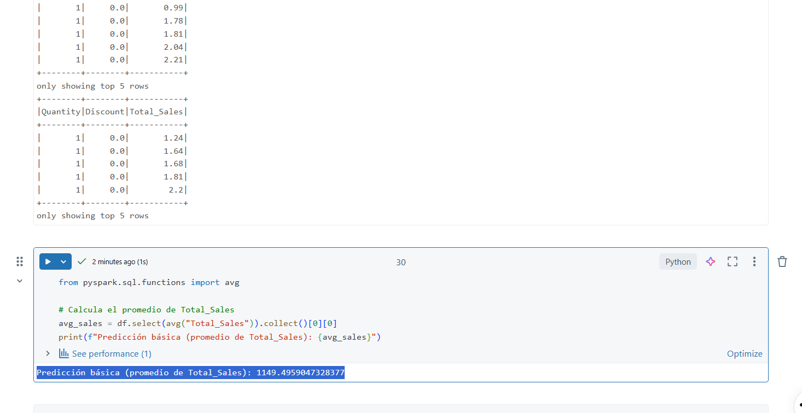

markdown
# Databricks Sales Analysis Project

A beginner-friendly project demonstrating data processing, analysis, and machine learning using Databricks.

## Overview

This repository contains a comprehensive project that showcases:
- ETL workflows with Apache Spark
- Reliable data storage with Delta Lake
- Machine learning tracking with MLflow
- Data analysis and visualization

Designed as a portfolio piece for junior data professionals, it highlights real-world Databricks features in an accessible way.

## Key Technologies

| Technology       | Purpose                          |
|------------------|----------------------------------|
| Databricks       | Unified analytics platform       |
| Apache Spark     | Distributed data processing      |
| Delta Lake       | ACID-compliant data storage      |
| MLflow           | Experiment tracking              |
| Python & SQL     | Data manipulation and queries    |

## Project Structure
databricks-sales-analysis/
├── Sales_Analysis.ipynb # Main Databricks notebook
├── data/ # Dataset directory
│ └── Superstore.csv # Sample dataset (from Kaggle)
├── README.md # Project documentation
└── screenshots/ # Visual documentation

text

## Dataset

**Source:** [Superstore Sales Dataset on Kaggle](https://www.kaggle.com/datasets)

**Columns Include:**
- Order ID, Order Date, Ship Date
- Customer ID, Product Name
- Sales, Quantity, Discount, Profit
- Region, Category, etc.

## Setup Instructions

1. **Create Account**: Sign up for [Databricks Community Edition](https://community.cloud.databricks.com/)
2. **Set Up Cluster**:
   - Create a single-node cluster
   - Use latest runtime version
3. **Import Data**:
   ```python
   # Example upload code
   dbutils.fs.put("/FileStore/tables/Superstore.csv", local_file_path)
Run Notebook: Import and execute the notebook step-by-step
    ```

## Project Timeline
Day 1: Configuration & Data Exploration
Objectives:

Set up Databricks environment

Load dataset into Spark DataFrame

Perform initial exploration

Code Example:

```python
from pyspark.sql import SparkSession

spark = SparkSession.builder.appName("SalesAnalysis").getOrCreate()
df = spark.read.csv("/FileStore/tables/Superstore.csv", header=True, inferSchema=True)
display(df.limit(5))
df.printSchema()
```
- Progress Update: Successfully loaded and explored the superstore table in Sales_Analysis notebook using the serverless environment. Challenge: Learned to troubleshoot cell execution by ensuring proper connection to the warehouse. Screenshot included below.

## Day 2: Data Cleaning & Delta Lake
Objectives:
-Handle missing values and type conversions
-Create calculated columns
-Implement Delta Lake storage

- Progress Update: 
Notebook Setup: Added Markdown for Day 2 objectives and verified serverless environment, resetting compute to fix execution errors like [RETRIES_EXCEEDED].
Data Cleaning: Loaded default.superstore table, inspected nulls in numeric columns (found none), filled nulls in Profit with 0, and created Profit_Adjusted to convert negatives to 0.
Data Transformation: Added Total_Sales column (Sales * Quantity) and grouped by Region to calculate totals (e.g., West ~3.6M, East ~3.4M).
Delta Lake Storage: Renamed columns to avoid invalid characters, saved as managed Delta table "superstore_transformed" with versioning, and verified with DESCRIBE HISTORY and show(5).
Initial Insights: West region leads in sales, suggesting focus for future analysis.
Challenges Overcome: Resolved type mismatches ([DATATYPE_MISMATCH]), column name errors ([DELTA_INVALID_CHARACTERS_IN_COLUMN_NAMES]), and DBFS restrictions by using managed tables.

## Day 3: Analysis & Machine Learning
Objectives:
- Execute SQL queries for business insights
- Create visualizations for data exploration
- Train a simple machine learning model with MLflow

- Progress Update: 
  - Notebook Setup: Added Markdown for Day 3 objectives and verified serverless environment.
  - SQL Analysis: Ran query to identify top 10 products by Total_Sales (e.g., FUR-TA-10000577 with high sales).
  - Visualizations: Created bar chart using Pandas to show Total_Sales_Region by Region (West leads ~3.6M), overcoming display() limitation with serverless.
  - Machine Learning: Used average prediction (Total_Sales ~1149.50) due to restrictions on LinearRegression and MLflow in Community Edition.
  - Initial Insights: West and East dominate sales, top products identified, average sales provide a baseline.
  - Challenges Overcome: Adapted to ML limitations by using a baseline average prediction instead of training a model.

## Day 4: Documentation & Deployment
Objectives:

Export polished notebook

Complete documentation

Deploy to GitHub

## Results & Insights
To be updated upon project completion

## Screenshots






## Lessons Learned
Key takeaways will be documented here

## Future Improvements
Integrate with cloud storage (S3/ADLS)

Implement advanced ML models

Add workflow scheduling

## License
MIT License - See LICENSE file for details