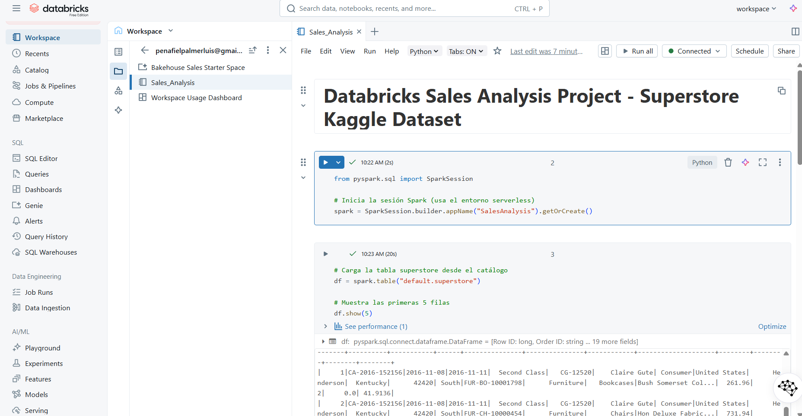
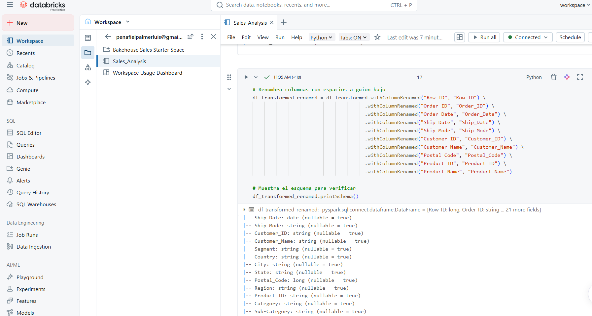
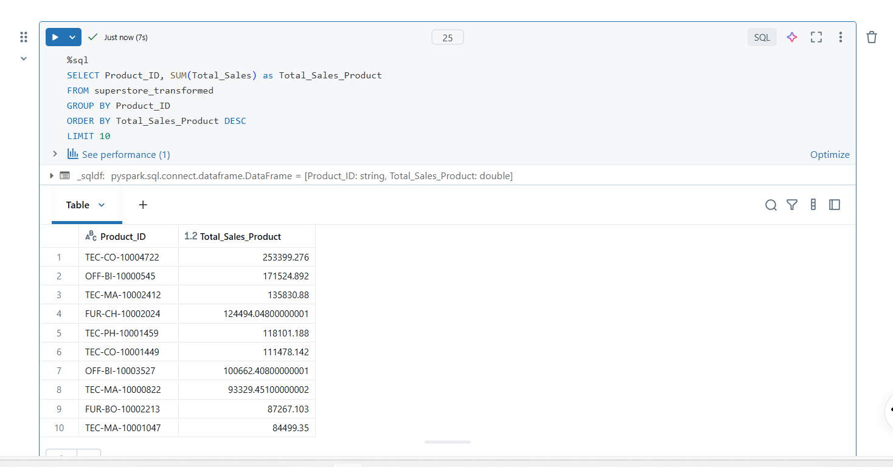
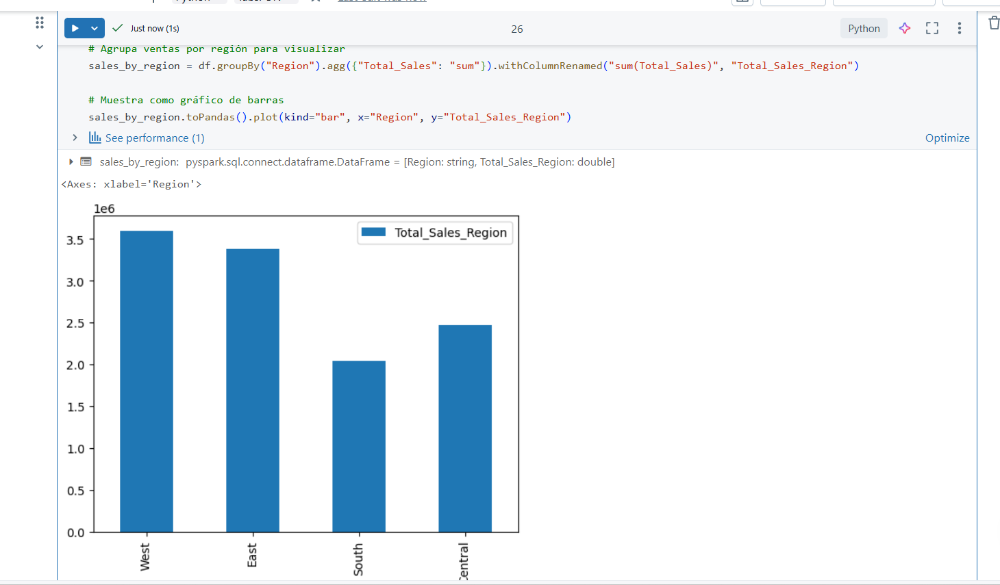
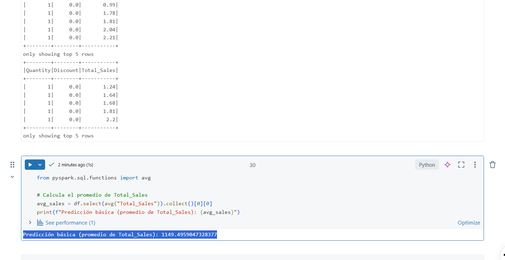
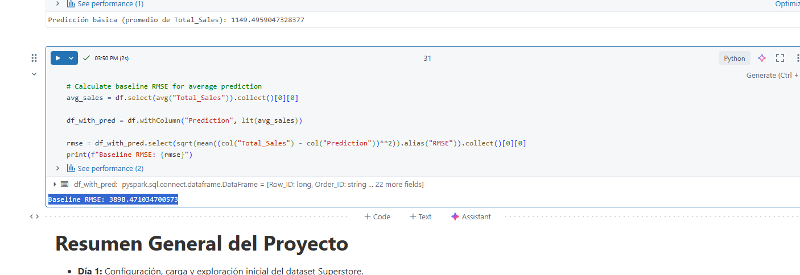

# Databricks Sales Analysis Project

A beginner-friendly project demonstrating data processing, analysis, and machine learning using Databricks. Designed as a portfolio piece for junior data professionals, it highlights real-world ETL workflows, Delta Lake storage, and adaptations to Community Edition limitations.

## Overview

This repository contains a comprehensive project that showcases:
- ETL workflows with Apache Spark
- Reliable data storage with Delta Lake
- Basic analysis and visualization
- Machine learning baseline
- Handling of real-world challenges like environment restrictions

## Key Technologies

| Technology       | Purpose                          |
|------------------|----------------------------------|
| Databricks       | Unified analytics platform       |
| Apache Spark     | Distributed data processing      |
| Delta Lake       | ACID-compliant data storage      |
| Python & SQL     | Data manipulation and queries    |

## Project Structure
databricks-sales-analysis/
├── Sales_Analysis.ipynb # Main Databricks notebook
├── data/ # Dataset directory
│ └── Superstore.csv # Sample dataset (from Kaggle)
├── screenshots-project/ # Visual documentation
├── README.md # Project documentation

## Dataset

**Source:** [Superstore Sales Dataset on Kaggle](https://www.kaggle.com/datasets/rohitsahoo/sales-data)

**Columns Include:**
- Order ID, Order Date, Ship Date
- Customer ID, Product Name
- Sales, Quantity, Discount, Profit
- Region, Category, etc.

**Size:** ~10,000 rows.

## Setup Instructions

1. **Create Account**: Sign up for [Databricks Community Edition](https://community.cloud.databricks.com/).
2. **Set Up Cluster**:
   - Create a single-node cluster with the latest runtime.
3. **Import Data**:
   - Upload Superstore.csv via Data > Create Table > Upload File.
   - Path: /FileStore/tables/Superstore.csv
4. **Run Notebook**: Import and execute Sales_Analysis.ipynb step-by-step.

## Project Timeline

### Day 1: Configuration, Data Loading, and Exploration (2-3 hours)
Objectives:
- Set up GitHub repo and Codespaces for DevOps.
- Configure Databricks Community Edition.
- Load and explore the dataset.

- Progress Update: 
  - Created GitHub repo and opened in Codespaces.
  - Signed up for Databricks Community Edition.
  - Downloaded and uploaded Superstore.csv, created table `default.superstore`.
  - Explored with Spark: df.show(5), df.printSchema(), df.describe(), df.count() (~10k rows).
  - Challenge: Fixed path errors with %fs ls.
  - Documented in notebook and README.

### Day 2: Data Cleaning & Delta Lake (3-5 hours)
Objectives:
- Handle missing values and type conversions
- Create calculated columns
- Implement Delta Lake storage

- Progress Update: 
  - Inspected nulls (none in numeric columns).
  - Cleaned Profit (filled nulls with 0, created Profit_Adjusted for negatives).
  - Transformed: Added Total_Sales (Sales * Quantity), grouped by Region (West ~3.6M).
  - Renamed columns (e.g., "Row ID" to "Row_ID") to fix invalid characters.
  - Saved as managed Delta table "superstore_transformed".
  - Verified with DESCRIBE HISTORY and show(5).
  - Challenges: Resolved type mismatches, column name errors, DBFS restrictions.
  - Insights: West leads sales.

### Day 3: Analysis & Machine Learning (2-4 hours)
Objectives:
- Execute SQL queries for business insights
- Create visualizations for data exploration
- Train a simple machine learning model

- Progress Update: 
  - Ran SQL query for top 10 products by Total_Sales.
  - Created bar chart with Pandas for Total_Sales by Region (West leads ~3.6M).
  - ML: Used average prediction (Total_Sales ~1149.50) due to restrictions on LinearRegression/MLflow.
  - Insights: West/East dominate sales, top products identified.
  - Challenges: Adapted to Community Edition limits by using baseline average.

### Day 4: Finalization & Presentation (1-3 hours)
Objectives:
- Export notebook and finalize documentation
- Polish GitHub repository for portfolio

- Progress Update: 
  - Added final summary to notebook with insights (West leads ~3.6M, average ~1149.50).
  - Exported notebook and updated README.
  - Repository polished with screenshots and structure.
  - Project ready for employers.

## Results & Insights
- West region leads sales (~3.6M), East second (~3.4M).
- Average Total_Sales ~1149.50.
- Insights: Focus on West for growth, investigate low-profit sub-categories.

## Screenshots

## Lessons Learned
- Adapted to Community Edition limits (e.g., ML restrictions).
- Learned Spark ETL, Delta Lake versioning, Pandas viz in Databricks.
- Overcame errors like datatype mismatches and path issues.

## Future Improvements
- Integrate with external storage (S3/ADLS).
- Add advanced ML (e.g., clustering) in paid environment.
- Schedule workflows in Databricks.

## License
MIT License - Feel free to use and modify.